 

VLSI and embedded systems · Outcome-based education tooling

---

## About

I teach and mentor undergraduate ECE students, and build software tools that support teaching, laboratory work and academic quality processes. My technical interests are digital and analog IC design, embedded systems and optimisation algorithms.

## Projects

| Project | Description |
|---|---|
| [cotas](https://github.com/ece-kalasalingam/cotas) | FOCUS (Framework for Outcome Computation and Unification System), a desktop tool for outcome-based education workflows |
| [fa-mentoring](https://github.com/ece-kalasalingam/fa-mentoring) | Student progress tracking by faculty mentors |
| [vlab](https://github.com/ece-kalasalingam/vlab) | Virtual laboratory for ECE experiments |
| [capstone-project-system](https://github.com/jeyaprakashk/capstone-project-system) | Workflow for capstone team intake, guide approval, review and evaluation |

## Publications

Full record: [Google Scholar](https://scholar.google.com/citations?user=qy5WiAwAAAAJ) · [ORCID](https://orcid.org/0000-0001-7493-1914) · [Web of Science](https://www.webofscience.com/wos/author/record/K-9233-2018)

<!-- PUBLICATIONS:START -->
- [Al-Mg-MoS2 reinforced hybrid metal matrix: Bio-machinability characteristics](https://doi.org/10.1016/j.sciaf.2025.e03131) — Scientific African, 2026
- [Intelligent Plant Disease Diagnosis: Harnessing Machine Learning and Deep Learning for Precision Agriculture](https://doi.org/10.1007/978-3-032-14041-8_27) — Lecture Notes in Networks and Systems, 2026
- [Machine Learning for Early Detection and Continuous Monitoring of Rheumatoid Arthritis](https://doi.org/10.1109/ICNSoC66817.2025.00109) — 2025
- [Advanced Optimized Quantum Learning for Robust Water Quality Assessment with an IoT Sensor Data](https://doi.org/10.18280/ISI.300207) — Ingenierie des Systemes d'Information, 2025
- [Block chain based novel energy efficient routing protocol for wireless sensor network](https://doi.org/10.1063/5.0247027) — AIP Conference Proceedings, 2025

Most recent works from ORCID · updated automatically
<!-- PUBLICATIONS:END -->
## Technical interests

- **Hardware description and IC design:** Verilog, VHDL, LTspice
- **Embedded systems:** C, microcontroller and IoT platforms
- **Numerical and optimisation work:** MATLAB, Python
- **Web and automation:** PHP, JavaScript, Google Apps Script

## Collaboration

Open to collaboration on embedded systems, VLSI design, educational technology and student projects.

<!---
jeyaprakashk/jeyaprakashk is a ✨ special ✨ repository because its `README.md` (this file) appears on your GitHub profile.
You can click the Preview link to take a look at your changes.
--->

